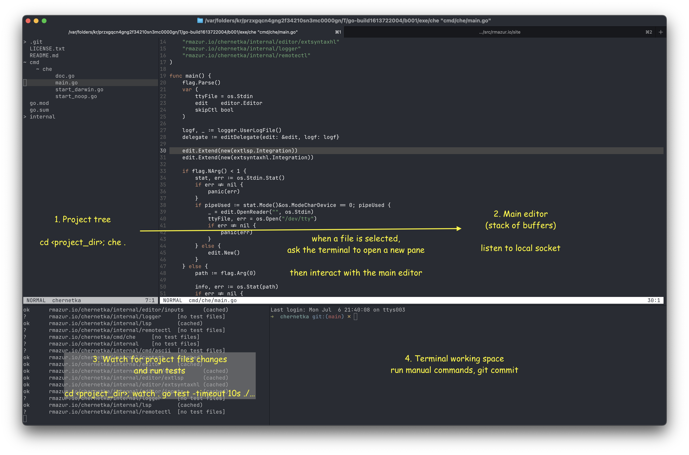

# chernetka 

An opinionated text editor with (a simple) normal, insert, and command (`:`) modes.
See docs of the `cmd/che` command for keybinding details (`cmd/che/doc.go`).

### Development

- Test with `go test ./...`
- For commits with changes generated by LLMs, use a tag `Assisted-by: <model name>` in the commit message. 
  Commit message should also contain a prompt (or its approximation) passed to the agent.

### Installation

Install with
```bash
go install rmazur.io/chernetka/cmd/che
```

To view images and d2 diagrams from the editor, install `che-img` as well:
```bash
go install rmazur.io/chernetka/cmd/che-img
```

Then start with opening your project directory
```
che .
```

To use it as a default text editor in your shell:
```
export EDITOR="che"
```

### Idea: terminal is my IDE


