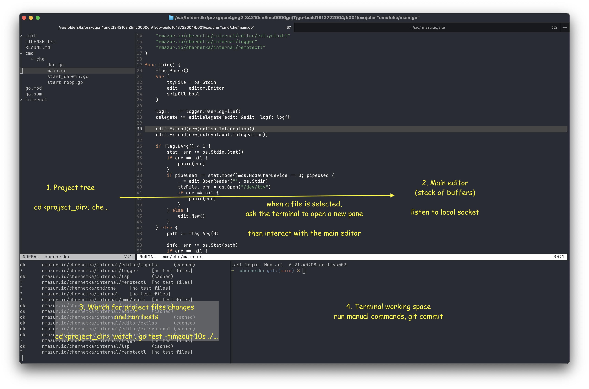

# chernetka 

An opinionated text editor with (a simple) normal, insert, and command (`:`) modes.
See docs of the `cmd/che` command for keybinding details (`cmd/che/doc.go`).

### Development

- Test with `go test ./...`
- Fuzz the editor with `go test -run '^$' -fuzz FuzzEditor ./internal/editor`: it types the fuzzed terminal input
  into the editor with the extensions of `che` but the LSP, running in the test process.
  The failing inputs are saved in `internal/editor/testdata/fuzz`.
- Run the monkey test typing random input into `che` with `CHEMONKEY=1 go test -count=1 -run TestMonkey ./cmd/che`.
  The crashes it finds, which are not fixed yet, are registered in [`.known-crashes`](.known-crashes).
- For commits with changes generated by LLMs, use a tag `Assisted-by: <model name>` in the commit message. 
  Commit message should also contain a prompt (or its approximation) passed to the agent.

### Installation

Install with
```bash
go install rmazur.io/chernetka/cmd/che@latest
```
A C compile is needed on the machine as syntax highlight currently depends on [treesitter](https://tree-sitter.github.io/).

To view images and d2 diagrams from the editor, install `che-img` as well:
```bash
go install rmazur.io/chernetka/cmd/che-img@latest
```

Then start with opening your project directory
```
che .
```

To use it as a default text editor in your shell:
```
export EDITOR="che"
```

### Idea: terminal is my IDE


